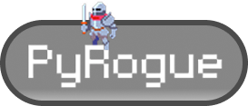

<p align="center">
  
</p>

# PyRogue

PyRogue is a 2D rogue-like game built using Python and Pygame. The game features procedurally generated environments, a leveling system, various abilities, and online scoreboards powered by Firebase.

Demo: https://www.youtube.com/watch?v=SbFXv9QtwzA

## Features

- **Procedurally Generated World**: Dynamic backgrounds and environments.
- **Leveling System**: Gain experience by defeating mobs and level up to unlock new abilities and power-ups.
- **Abilities and Power-Ups**: Choose from a variety of abilities and upgrades to enhance your gameplay.
- **Online Scoreboard**: Save and view high scores globally using Firebase Firestore.

---

## Installation

### Prerequisites

- Python 3.8 or higher
- Pip (Python package manager)

### Steps

1. Clone the repository:
   ```bash
   git clone <repository-url>
   cd CS50-Final
   ```
2. Install dependencies:
   ```bash
   pip install -r requirements.txt
   ```
3. Decript the firebase adminsdk To use the online features:

   1. Download openssl from https://slproweb.com/products/Win32OpenSSL.html

   2. Add OpenSSL to PATH (If Not Done Automatically) so that your system will recognize the openssl command

   3. Decript the file:

   ```bash
   openssl enc -aes-256-cbc -d -in firebase-adminsdk.json.enc -out firebase-adminsdk.json -k pyrogue
   ```

### Usage

1. Run the game:
   ```bash
   python project.py
   ```
   Command-Line Options:

- **-f, --fullscreen**: Enable fullscreen mode
- **-o, --offline**: Disable online features

Example:

```bash
python project.py -f -o
```

### Controls

- **Arrow Keys**: Move player
- **ESC**: Pause game

### Gameplay

- **Level Up**: Gain experience by defeating mobs and level up to unlock new abilities and power-ups.
- **Abilities and Power-Ups**: Choose from a variety of abilities and upgrades to enhance your gameplay.
- **Defeat Mobs:**: Survive waves of enemies and gain experience.
- **Online Scoreboard**: Save and view the highest scores globally using Firebase Firestore.

### Development

Project Structure

```bash
CS50 Final/
├── assets/                # Game assets (images, audio, definitions)
├── src/                   # Source code
│   ├── attacks/           # Attack mechanics
│   ├── mobs/              # Enemy logic
│   ├── ui/                # UI components
│   ├── game.py            # Main game logic
│   ├── player.py          # Player logic
│   ├── firestore.py       # Firebase integration
│   ├── unit.py            # Base unit class
│   └── ...
├── [test_project.py](http://_vscodecontentref_/2)        # Unit tests
├── [requirements.txt](http://_vscodecontentref_/3)       # Dependencies
└── [project.py](http://_vscodecontentref_/4)             # Entry point
```

### Dependencies

- Pygame www.pygame.org
- Firebase Admin SDK https://firebase.google.com/docs/admin/setup
- Requests https://requests.readthedocs.io/en/latest/

### Dependencies

All visual assets are free to use downloaded from Itch.io, music was generated with AI using suno.com

### Acknowledgments

This project was developed as part of the CS50 Final Project.
